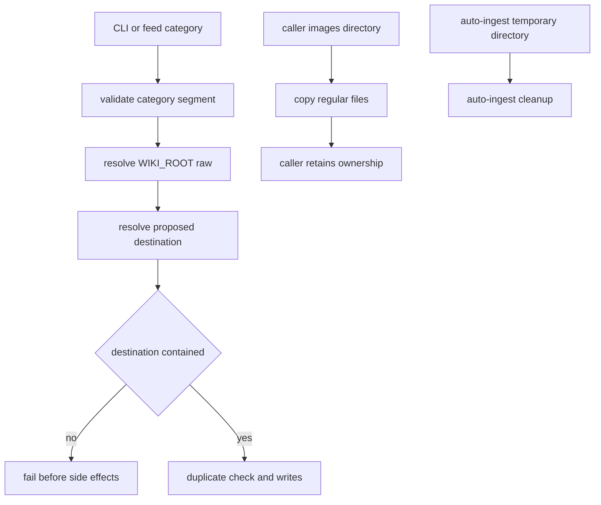

# Knowledge Wiki Ingest Safety and Portability - Plan

## Goal Capsule

- **Objective:** Remove the two confirmed filesystem hazards, make the fixes deterministic to verify, restore portable defaults, reduce agent-instruction noise, and tighten only exception paths whose harmful behavior is demonstrated.
- **Authority:** The requirements and boundaries in `plans/audit-2026-07-11.md` override implementation convenience; current code patterns define naming and CLI compatibility where the audit is silent.
- **Execution profile:** Safety-first, characterization-first, six serial implementation units with focused commits.
- **Stop conditions:** Stop if preserving `--images-dir` would break a documented ownership-transfer contract, if legitimate categories require nested paths or symlink traversal, or if an exception-handler change would alter successful ingest semantics without a failing proof.
- **Tail ownership:** Run repository verification, code review, and normal branch-finishing gates after all units pass.

---

## Product Contract

### Summary

The ingest pipeline must preserve caller-owned input directories and confine category-derived output beneath `WIKI_ROOT/raw`.
These safety guarantees need deterministic offline tests rather than live network ingestion as their only proof.
The packaged skill must also use a neutral wiki-root default, keep agent instructions concise, and replace broad exception handling only where tests demonstrate an incorrect outcome.

### Problem Frame

`scripts/ingest_source.py` accepts an arbitrary `--images-dir`, copies its contents, and recursively deletes the supplied directory even though the CLI does not establish transfer of ownership.
The same script interpolates CLI- and feed-derived categories into mkdir, duplicate-check, asset, and write paths without a single containment boundary.
The project has no deterministic test suite for these behaviors, while `config.yaml` contains a maintainer-specific path and `SKILL.md` mixes executable guidance with duplicated incident history.
Broad exception handlers are a secondary risk: one YouTube API incompatibility was demonstrably hidden, but the handler count alone does not justify a blanket rewrite.

### Requirements

**Filesystem safety**

- R1. `scripts/ingest_source.py` must never delete or mutate the caller-supplied `--images-dir` beyond reading and copying its regular files.
- R2. Category input must be exactly one non-empty folder-name segment and must reject absolute paths, `.` or `..`, forward or backward separators, and resolved destinations outside the resolved `WIKI_ROOT/raw` root.
- R3. The category invariant must guard duplicate checks, directory creation, source writes, asset copies, and every other category-derived filesystem operation before side effects occur.
- R4. Invalid category input must fail with a clear non-zero CLI result and must not normalize ambiguous input into a different category.

**Verification and portability**

- R5. Focused offline regression tests must prove R1-R4 with temporary wiki roots and no real network, Ollama, browser, or external process dependency.
- R6. The repository must expose one deterministic standard-library test command that covers the safety regressions and can grow into a broader verification baseline without adding a runtime dependency.
- R7. The committed default configuration must resolve to a neutral, documented path rather than a maintainer-specific filesystem location.

**Instruction and failure quality**

- R8. `SKILL.md` must keep routing rules, invariants, canonical commands, and current pitfalls while deleting content duplicated by focused references; unique operational knowledge may move only to an existing appropriate reference or a narrowly scoped new reference.
- R9. Broad exception handlers must be classified by observable behavior before modification; only handlers with a failing regression proof of silent loss, false success, or corrupted state are changed in this plan.
- R10. Direct user-selected URL fetching remains supported; unattended RSS, redirect, email-asset, browser-network, and email-retention policy changes are outside this plan.

### Acceptance Examples

- AE1. Given a persistent directory passed via `--images-dir`, when ingest succeeds, then its files still exist in the original directory and copied assets exist under the source page's asset directory.
- AE2. Given `--category ../outside`, `/tmp/outside`, `a/b`, `a\\b`, `.`, `..`, or an empty explicit value, when ingest starts, then it exits before creating or writing anything outside `WIKI_ROOT/raw`.
- AE3. Given a category destination that resolves through a symlink outside `WIKI_ROOT/raw`, when containment is checked, then ingest rejects it before filesystem mutation.
- AE4. Given `--category ai-agents`, when ingest runs against a temporary wiki root, then source and asset paths remain compatible with the current `raw/ai-agents/...` layout.
- AE5. Given a fresh checkout with no CLI or `WIKI_ROOT` override, when any user-facing script resolves its wiki root, then it applies the shared CLI-over-environment-over-config-over-`~/knowledge` contract for the inputs that script exposes.
- AE6. Given one transcript provider that raises the verified API incompatibility, when a later provider returns a transcript, then the provider failure is observable and the overall transcript fetch succeeds. When all transcript providers fail, description-only source ingestion may still succeed, but logs and return values must not claim that a transcript was fetched.

### Scope Boundaries

**In scope**

- Caller-owned image-directory preservation.
- Category validation and resolved-path containment.
- Standard-library unit and CLI-level regression tests for the affected behavior.
- Portable default configuration and aligned documentation.
- `SKILL.md` deduplication without discarding unique operational knowledge.
- A bounded, test-backed exception-handling slice around transcript and ingest outcomes.

**Deferred for later**

- Unattended-source SSRF controls, redirect revalidation, email confidentiality and retention, remote image policy, and browser sandboxing.
- Wider exception cleanup after classification identifies additional harmful classes.
- A standalone `skill_doctor.py`; reconsider only if setup incidents persist after portable defaults and validation improve diagnostics.

**Outside this plan**

- GraphRAG retrieval behavior, clustering, embeddings, synthesis quality, or graph schema changes.
- New category hierarchies, automatic category normalization, or support for nested category paths.
- New third-party test, validation, or CLI frameworks.

---

## Planning Contract

### Key Technical Decisions

- KTD1. **Use the Python standard library test stack.** Add `unittest`, `tempfile`, and `unittest.mock` coverage so verification works without expanding `requirements.txt` or requiring network services.
- KTD2. **Centralize category validation in `scripts/wiki_core.py`.** A pure helper owns the single-segment contract and a containment helper resolves proposed paths against `WIKI_ROOT/raw`; all callers reuse these boundaries.
- KTD3. **Reject rather than normalize unsafe categories.** Silent cleanup could merge distinct inputs, hide feed misconfiguration, or preserve traversal ambiguity.
- KTD4. **The callee never owns `--images-dir`.** `scripts/ingest_source.py` copies but does not clean it. Producers such as `scripts/auto_ingest.py` remain responsible for deleting temporary directories they created.
- KTD5. **Use focused tests as the safety gate, then broaden.** R1-R4 tests land with their behavior changes; the common test command and additional characterization build on those seams rather than delaying the fixes.
- KTD6. **Treat exception handlers by outcome, not syntax.** Preserve intentional fallbacks and log-and-continue behavior; change a handler only when a test proves silent loss, false success, or invalid state transition.
- KTD7. **Use `~/knowledge` as the portable fallback.** It already appears in README and script fallback behavior, minimizing compatibility drift while removing the personal path.

### High-Level Technical Design

### Sequencing

U1 establishes the test harness and pure validation seam.
U2 and U3 then land the two safety fixes with red-before-green regression evidence.
U4 is independently deliverable after U1.
U5 follows U4 only because it documents the shared resolution contract.
U6 depends on the common test seam, not on completion of the safety or documentation units.

### Implementation-Time Unknowns

- Whether existing user wikis contain category symlinks is not known. The secure default is rejection; stop and report if repository fixtures or documented workflows prove symlinks are intentional.
- The exact set of broad handlers eligible for U6 depends on characterization results. Do not convert every `except Exception`; complete the unit with an inventory plus only verified harmful fixes.

---

## Implementation Units

### U1. Establish offline safety test seams

- **Goal:** Create a deterministic test command and pure category validation/containment helpers that can be proven without running the full ingest pipeline.
- **Requirements:** R2, R5, R6
- **Files:** Create `tests/test_wiki_core.py`; modify `scripts/wiki_core.py`; optionally create `tests/__init__.py` only if discovery requires it.
- **Approach:** Add pure helpers for validating one category segment and resolving a descendant path below `WIKI_ROOT/raw`. Keep validation independent of argparse and filesystem mutation. Tests should import project scripts using the repository's existing layout rather than packaging the project as a new module.
- **Patterns to follow:** `scripts/wiki_core.py:56-76` for small deterministic helpers; `scripts/wiki_core.py:232-269` for `PurePosixPath`-aware path logic.
- **Execution note:** Write the invalid-input and containment tests first and observe their expected import or behavior failure before implementing the helpers.
- **Test scenarios:** Accept `ai-agents`; reject empty, `.`, `..`, `../x`, `/tmp/x`, `a/b`, and `a\\b`; reject a proposed destination resolving outside `raw`; reject escape through a pre-created symlink; accept a normal nested destination assembled by trusted code beneath a validated category.
- **Verification:** `python3 -m unittest tests.test_wiki_core`
- **Dependencies:** None.

### U2. Preserve caller-owned image directories

- **Goal:** Remove recursive cleanup from `ingest_source.py` while preserving asset copy and producer-owned cleanup behavior.
- **Requirements:** R1, R5
- **Files:** Create `tests/test_ingest_source.py`; modify `scripts/ingest_source.py`; inspect but modify `scripts/auto_ingest.py` only if ownership boundaries are unclear in code comments or cleanup flow.
- **Approach:** Extract or test the smallest asset-copy seam practical, remove the callee-side `shutil.rmtree(images_dir, ignore_errors=True)`, and leave `auto_ingest.py` responsible for temporary directories it creates. Avoid a new cleanup flag unless an existing documented caller requires ownership transfer.
- **Patterns to follow:** `scripts/ingest_source.py:1254-1274` for current copy/rewrite behavior; `scripts/auto_ingest.py:1144-1206` for producer-owned temporary-directory cleanup.
- **Execution note:** Add a regression test that proves the source directory disappears under current behavior, then make it remain while preserving copied output.
- **Test scenarios:** Successful copy preserves original files; source markdown image links still rewrite to `assets/<slug>/`; missing `--images-dir` remains a warning/no-op; non-file children are not copied or deleted; auto-ingest-owned temporary directories are still cleaned by auto-ingest.
- **Verification:** `python3 -m unittest tests.test_ingest_source`
- **Dependencies:** U1.

### U3. Enforce category containment across ingest paths

- **Goal:** Apply the shared category and containment boundary before every category-derived side effect.
- **Requirements:** R2, R3, R4, R5
- **Files:** Modify `scripts/ingest_source.py`, `scripts/auto_ingest.py`, and `tests/test_ingest_source.py`; extend `tests/test_wiki_core.py` when helper contracts change.
- **Approach:** Inventory every category-to-path construction with a repository search, then validate explicit CLI categories and auto-categorizer/feed results through the same helper. Resolve the raw root and proposed paths before duplicate checks, mkdir, source writes, and asset copies. Expand the unit's file list if discovery finds another active category-derived filesystem caller; otherwise narrow any universal claim to the audited ingest paths. Surface invalid input through argparse-compatible or logged non-zero failure without partial output.
- **Patterns to follow:** `scripts/ingest_source.py:1108-1133` for CLI error handling; `scripts/ingest_source.py:1212-1249` for source-path construction; `scripts/auto_ingest.py:172-215` for child-process failure propagation.
- **Execution note:** Strengthen the tests with CLI-level failures before changing call sites; record that no outside path was created after each failure.
- **Test scenarios:** All AE2 inputs fail non-zero; symlink escape fails; normal CLI category succeeds; auto-categorized valid value succeeds; invalid feed category fails without marking ingest successful; duplicate checks and asset paths cannot escape independently.
- **Verification:** `rg -n 'raw.*category|category.*raw|/ category|f"raw/\{category\}' scripts` must leave no unreviewed active category-to-path construction; then run `python3 -m unittest tests.test_wiki_core tests.test_ingest_source`.
- **Dependencies:** U1, U2.

### U4. Align portable configuration and verification entry point

- **Goal:** Remove the personal default path and document one deterministic local verification command.
- **Requirements:** R6, R7
- **Files:** Modify `config.yaml`, `README.md`, `SKILL.md`, `scripts/wiki_core.py`, and every user-facing script identified by the resolution inventory, including at minimum `scripts/ingest_source.py`, `scripts/auto_ingest.py`, `scripts/relevance_check.py`, `scripts/wiki_graph_builder.py`, and `scripts/regen_index.py`; create `tests/test_config_resolution.py`.
- **Approach:** Put the shared CLI-over-environment-over-config-over-`~/knowledge` resolution behavior in `scripts/wiki_core.py`, inventory every script that resolves a wiki root, and migrate each user-facing caller to the shared helper without inventing CLI flags it does not expose. Change the committed default to `~/knowledge`, align README and SKILL descriptions, and document `python3 -m unittest discover -s tests -p 'test_*.py'` as the offline regression command distinct from optional live end-to-end verification.
- **Patterns to follow:** `README.md:68-71` for the public default; `scripts/ingest_source.py:44-69` and `scripts/wiki_core.py` callers for current config resolution.
- **Execution note:** This is behavior-bearing configuration work. Characterize current per-script precedence first, then introduce failing expectations for the shared contract and neutral default before refactoring callers.
- **Test scenarios:** Config with `~/knowledge` expands consistently; `WIKI_ROOT` overrides config; explicit `--wiki-root` overrides environment where supported; the test discovery command finds and runs all new tests.
- **Verification:** `python3 -m unittest discover -s tests -p 'test_*.py'`
- **Dependencies:** U1.

### U5. Reduce agent instruction duplication

- **Goal:** Make `SKILL.md` an executable routing and invariant guide rather than an incident ledger without losing unique recovery knowledge.
- **Requirements:** R8
- **Files:** Modify `SKILL.md` and only the existing files under `references/` that receive unique retained material; create `tests/test_docs.py` for deterministic local-reference validation.
- **Approach:** Deduplicate the repeated Substack fetch trade-off, remove resolved implementation-history entries, repair the malformed literal `\\n` table row, and keep short links to focused references. Before deleting an incident entry, confirm whether its actionable content already exists in a referenced document; move only unique still-valid guidance.
- **Patterns to follow:** `SKILL.md:31-69` for routing-oriented instructions; `references/readme-standards.md` for shareability expectations.
- **Execution note:** This is documentation behavior: verify link targets and routing coverage rather than adding code tests.
- **Test scenarios:** Every referenced local file exists; Substack/YouTube/email routing rules remain findable once; no literal `\\n` remains in markdown tables; the README stays generic and English-only.
- **Verification:** `python3 -m unittest tests.test_docs` followed by `git diff --check`.
- **Dependencies:** U4.

### U6. Classify and tighten verified harmful exception paths

- **Goal:** Produce a bounded exception inventory and fix only transcript/ingest handlers whose tests demonstrate silent loss or false success.
- **Requirements:** R9
- **Files:** Create `tests/test_auto_ingest.py` and `references/exception-handling-inventory.md`; modify `scripts/auto_ingest.py`; modify `scripts/ingest_source.py` only for a separately proven harmful path.
- **Approach:** Record each reviewed handler in `references/exception-handling-inventory.md` with its location, classification, disposition, and linked regression proof. Classify handlers as intentional fallback, log-and-continue, state-mutating recovery, or success/skip recording. Start with `_fetch_video_transcript`, `_ytdlp_transcript`, `_yt_transcript_api_fallback`, `process_youtube`, and the ingest subprocess boundary. Replace broad catches with expected exception families or explicit failure results only where a regression test proves harm. Preserve intentional multi-provider fallback and keep description-only source ingestion successful when the source write succeeds; distinguish that result from transcript-fetch success in logs and return values.
- **Patterns to follow:** `scripts/auto_ingest.py:296-425` for provider fallback; `scripts/auto_ingest.py:713-757` for YouTube processing outcomes; `scripts/auto_ingest.py:172-237` for child ingest result handling.
- **Execution note:** Characterize successful fallback and failure reporting first. Do not claim red-before-green evidence for handlers that remain unchanged.
- **Test scenarios:** Current transcript API mismatch is observable; provider A failure still permits provider B success; all providers failing yields an explicit transcript-unavailable outcome while description-only source ingest may still succeed; ingest subprocess timeout and non-zero exit do not mark a source processed; unexpected exceptions include actionable context without leaking content or credentials.
- **Verification:** `python3 -m unittest tests.test_auto_ingest` followed by the full discovery command; every changed exception handler must have a matching inventory row and regression test.
- **Dependencies:** U1.

---

## Verification Contract

| Gate | Command | Applies to | Expected result |
|---|---|---|---|
| Python syntax | `python3 -m compileall -q scripts tests` | U1-U6 | Exit 0 with no syntax errors |
| Focused core tests | `python3 -m unittest tests.test_wiki_core` | U1, U3 | All validation and containment cases pass |
| Focused ingest tests | `python3 -m unittest tests.test_ingest_source` | U2, U3 | Image ownership and CLI containment regressions pass |
| Focused auto-ingest tests | `python3 -m unittest tests.test_auto_ingest` | U6 | Fallback and failure-state cases pass |
| Full offline suite | `python3 -m unittest discover -s tests -p 'test_*.py'` | U1-U6 | All tests pass without network, Ollama, Playwright, or external binaries |
| Patch hygiene | `git diff --check` | U1-U6 | No whitespace or patch errors |
| Documentation links | `python3 -m unittest tests.test_docs` | U5 | Every non-example local reference resolves |

Live URL ingestion remains optional exploratory verification and must not replace the offline gates.
If a live check is run, use a disposable temporary wiki root and never a personal production archive.

---

## Definition of Done

- R1-R9 are each covered by at least one completed implementation unit and corresponding verification evidence.
- `--images-dir` content survives successful and failed ingest attempts unless the creating producer explicitly cleans its own temporary directory.
- Invalid or escaping categories fail before side effects; valid single-segment categories preserve the existing layout.
- The full offline suite passes from a fresh checkout without live services.
- `config.yaml`, README, SKILL guidance, and script fallback behavior agree on the portable wiki-root default and resolution priority.
- `SKILL.md` contains no duplicated incident ledger or malformed table escape while all current routing rules remain accessible.
- Exception changes are limited to handlers with demonstrated harmful outcomes; intentional fallbacks remain intact and classified.
- Deferred unattended-source and email security policy is not silently implemented or decided.
- No abandoned helpers, temporary fixtures, debug logs, or experimental code remain in the final diff.
