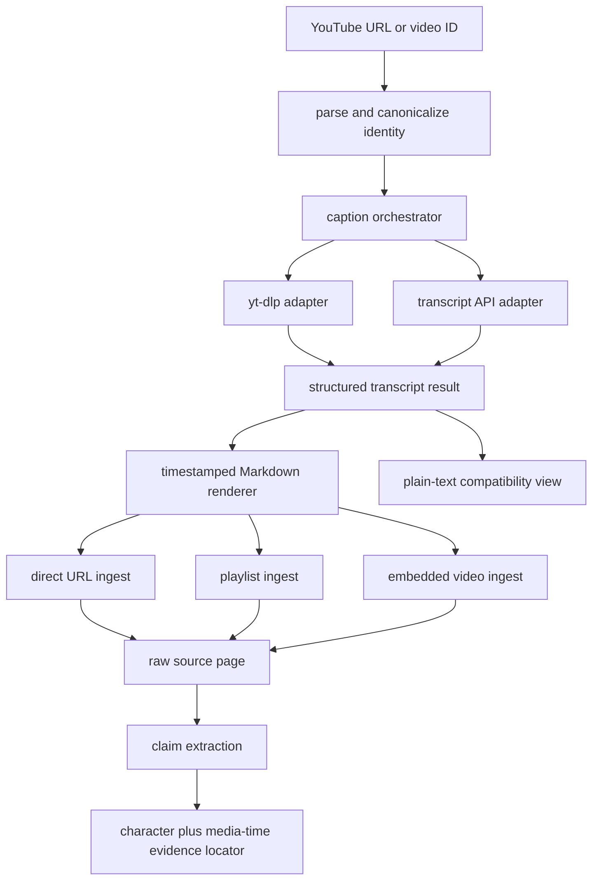
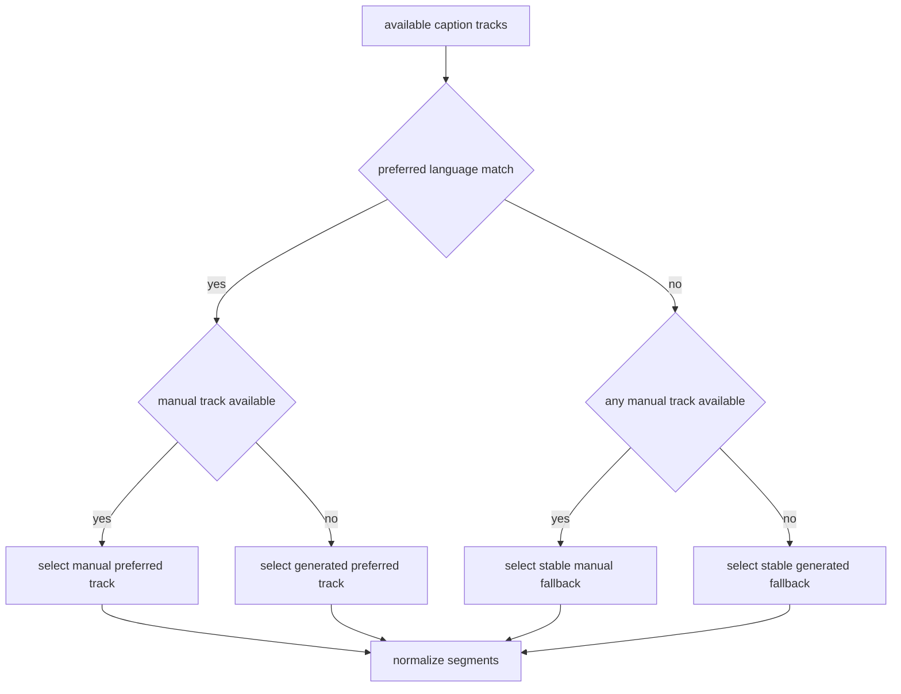

# feat: Unify reliable YouTube transcript ingestion

## Goal Capsule

- **Objective:** Make direct YouTube URLs, playlist entries, and embedded YouTube videos use one reliable transcript pipeline that recognizes current URL forms, prefers suitable captions, preserves segment timestamps, and exposes those timestamps as claim evidence anchors.
- **Authority:** The user-confirmed scope in this planning session governs behavior; existing ingest safety, coordinated-write, claim-ledger, and offline-test contracts remain binding.
- **Execution profile:** Test-first, four dependency-ordered implementation units, no live YouTube dependency in the automated suite.
- **Stop conditions:** Stop if supporting timestamp evidence requires replacing the existing character-range locator contract, if direct YouTube ingestion cannot avoid HTML fetching without changing non-YouTube URL behavior, or if an upstream API version cannot be supported without an unplanned dependency change.
- **Tail ownership:** After the focused transcript and ingest tests pass, run the complete offline suite, syntax compilation, metadata validation, and diff hygiene checks.

---

## Product Contract

### Summary

The wiki will use a single YouTube transcript boundary for URL recognition, caption selection, provider fallback, timestamp-preserving rendering, and diagnostics. Direct videos, playlist videos, and YouTube embeds will share this behavior while generic non-YouTube video handling remains unchanged.

### Problem Frame

YouTube behavior is currently split across `scripts/auto_ingest.py` and `scripts/ingest_source.py`. URL parsing is duplicated and misses `shorts`, `live`, raw IDs, and watch URLs whose `v` parameter is not first. The yt-dlp path requests only English auto-captions, the API fallback hard-codes English then German without inspecting available tracks, and VTT cleanup removes timestamps while only deduplicating identical adjacent lines.

Playlist ingestion has a safer path than direct URL ingestion: it always supplies transcript content through a temporary file, while `ingest_source.py --url <youtube-url>` still attempts to fetch YouTube HTML and can encounter bot detection. The current plain-text result also prevents the claim ledger from pointing readers to the moment in a video that supports a claim.

### Requirements

**Canonical YouTube identity and transcript result**

- R1. One dependency-light module must recognize an 11-character video ID supplied directly or through `youtube.com/watch`, `youtu.be`, `youtube.com/embed`, `youtube-nocookie.com/embed`, `youtube.com/shorts`, and `youtube.com/live` URLs, independent of query-parameter order.
- R2. All recognized inputs must normalize to one canonical watch URL so deduplication and provider calls identify the same video consistently.
- R3. A successful fetch must return structured segments containing text, start time, and duration, plus provider, language, caption-kind, and optional video-title metadata when the provider exposes them.
- R4. The structured result must render deterministic readable Markdown with timestamps while still offering derived plain text for compatibility with non-YouTube callers.

**Caption selection and provider resilience**

- R5. Caption selection must use a configurable preferred-language list with the existing English/German behavior as the compatibility default.
- R6. Manual captions must be preferred over generated captions within the language preference policy; when preferred languages are unavailable, the API provider must inspect available tracks and select a deterministic fallback rather than guessing language codes indefinitely.
- R7. Provider failures, empty tracks, unavailable dependencies, and timeouts must remain observable and must allow the next provider or track to succeed without falsely reporting transcript success.
- R8. VTT parsing must remove markup and rolling-caption overlap without deleting legitimate repeated speech, and it must preserve cue timing for the retained text.

**Ingest integration and provenance**

- R9. Direct YouTube URL ingestion must bypass generic HTML fetching and use the same transcript pipeline and timestamped raw-source representation as playlist ingestion.
- R10. Playlist and embedded-video ingestion must reuse the canonical YouTube module without changing generic Vimeo, X/Twitter, Substack-video, poster-image, or ordinary web-page behavior.
- R11. When no transcript exists, playlist ingestion may retain its description-or-placeholder fallback, but the result must be explicitly distinguishable from a fetched transcript in content and logs.
- R12. Claims extracted from timestamped YouTube sources must retain the existing source path, source hash, excerpt hash, and character range while adding an optional media-time range derived from the supporting transcript segment.
- R13. Existing claim sidecars without media-time data must continue to load and validate unchanged.

### Acceptance Examples

- AE1. Given `https://youtube.com/watch?list=x&v=abcdefghijk&t=30`, a Shorts URL, a Live URL, an embed URL, a youtu.be URL, or `abcdefghijk`, normalization returns the same video ID and canonical watch URL.
- AE2. Given manual German captions and generated English captions with preferences `de,en`, caption selection returns the manual German track; given no preferred-language track, it selects the deterministic first available track and records the actual language and kind.
- AE3. Given rolling VTT cues `hello world` followed by `world from Berlin`, parsing produces `hello world from Berlin` with usable timing rather than duplicated overlap or discarded cues.
- AE4. Given `ingest_source.py --url <youtube-url>`, ingestion obtains the transcript without calling the generic URL fetcher and writes a raw source containing timestamps and the original URL.
- AE5. Given the same video through a playlist and through direct ingestion, both paths produce the same canonical source URL and equivalent transcript body representation.
- AE6. Given an extracted claim supported by a timestamped segment, its evidence locator includes a media-time range while retaining the existing character-range and hash validation fields; a legacy locator without media time still validates.
- AE7. Given no caption from any provider, direct ingestion fails clearly rather than saving YouTube HTML, while playlist ingestion may save its explicitly labeled description fallback and must not log that a transcript was fetched.

### Scope Boundaries

**In scope**

- YouTube URL and ID recognition, normalization, caption discovery, selection, provider fallback, VTT parsing, and structured transcript results.
- Direct URL, playlist, and embedded-YouTube integration.
- Timestamped Markdown source content and optional media-time evidence locators.
- Deterministic, offline unit and integration tests using provider and subprocess fakes.
- Updating current YouTube ingestion documentation and dependency guidance.

**Deferred to Follow-Up Work**

- Wiring language preferences into new user-facing CLI or YAML options; the transcript API accepts a preference list in this plan, while existing callers retain the English/German compatibility default.
- Retrofitting timestamp locators onto previously ingested plain-text YouTube sources.
- Applying structured transcript results to Vimeo, X/Twitter, or Substack-native video.

**Outside this plan**

- Downloading audio and running speech-to-text when captions do not exist.
- Frame extraction, OCR, vision analysis, chapter generation, or semantic video summarization.
- New retry queues, distributed rate limiting, proxy rotation, cookies, or bot-detection bypass mechanisms.
- Changes to entity/concept extraction prompts or claim semantics unrelated to evidence location.

---

## Planning Contract

### Key Technical Decisions

- KTD1. **Introduce `scripts/youtube_transcripts.py` as the canonical boundary.** It owns YouTube identity, structured results, provider selection, VTT parsing, and rendering. This removes the current `ingest_source.py` dependency on `auto_ingest.py` and prevents playlist orchestration from becoming a reusable library by accident.
- KTD2. **Keep the result model in the standard library.** Dataclasses or equivalent typed records represent segments and transcript metadata; no new runtime framework is needed.
- KTD3. **Return structured data internally and render at ingest boundaries.** Providers never return an unstructured text string. Compatibility plain text and timestamped Markdown are derived views, which keeps selection metadata and timing available until the raw source is written.
- KTD4. **Apply a deterministic selection order.** For each preferred language, select manual before generated; if none match, inspect available tracks and choose a stable fallback, again preferring manual. Record the selected track instead of inferring it later.
- KTD5. **Treat yt-dlp and youtube-transcript-api as adapters.** Each adapter normalizes its native output into the same result model and exposes failures as logged empty outcomes or typed internal failures that the orchestrator can continue past. File existence remains the yt-dlp success signal because the repository documents non-zero exits that still produce subtitle files.
- KTD6. **Use overlap-aware cue merging, not global deduplication.** Merge only adjacent rolling-caption suffix/prefix overlap and preserve repeated phrases at different times. Cue start/duration must follow the retained text span.
- KTD7. **Render timestamps into the canonical raw Markdown.** Timestamp markers make the source human-navigable and allow evidence-time recovery without a separate transcript sidecar. Plain text remains available only as a compatibility view.
- KTD8. **Extend evidence locators additively.** `media_time_range` is optional and derived from the nearest timestamped transcript segment supporting the excerpt. Existing locator keys and validation remain authoritative, so old sidecars need no migration.
- KTD9. **Do not hide YouTube failure behind HTML fallback.** A recognized direct YouTube URL either yields a transcript source or a clear unavailable result. Playlist orchestration may deliberately ingest a labeled description fallback because that is an existing unattended-workflow policy.
- KTD10. **Resolve direct-ingest titles without fetching YouTube HTML.** Prefer an explicit `--title`, then provider metadata, then a deterministic video-ID label so title lookup cannot reintroduce the bot-prone HTML path.

### High-Level Technical Design

### Sequencing

U1 establishes the shared identity and result contracts. U2 implements provider adapters and caption parsing against those contracts. U3 moves all ingest entry points to the shared module. U4 adds media-time evidence and documentation after the timestamped raw-source format is stable.

### System-Wide Impact

- **Agents and users:** Prompts that request a YouTube URL become reliable regardless of whether they enter through direct ingest, an automated playlist, or an article embed.
- **Wiki data:** New YouTube raw sources contain timestamp markers; existing sources and sidecars remain readable without migration.
- **Operations:** yt-dlp and youtube-transcript-api remain optional providers. Diagnostics identify which adapter and language failed, while tests remain fully offline.
- **Non-YouTube ingestion:** Generic video and web-page flows retain their current interfaces and behavior.

### Risks and Mitigations

- **Provider API drift:** Keep provider-specific types and exceptions inside adapters and test representative v1 object shapes rather than spreading API assumptions through callers.
- **Caption-selection surprises:** Make preference order explicit, log the actual chosen language/kind, and cover manual/generated and preferred/fallback matrices.
- **Transcript corruption from overlap merging:** Limit merging to adjacent cues with exact normalized suffix/prefix overlap and preserve timing; cover legitimate repetition separately.
- **Timestamp-to-claim mismatch:** Derive media time only when a supporting timestamp can be located confidently; omit the optional field rather than guessing.
- **Behavior regression for generic video:** Keep generic yt-dlp handling in `auto_ingest.py` and route only recognized YouTube identities through the new module.

---

## Implementation Units

### U1. Establish canonical YouTube identity and result contracts

- **Goal:** Create the reusable, dependency-light module and stable data model that every YouTube ingest path can share.
- **Requirements:** R1-R4
- **Dependencies:** None.
- **Files:** Create `scripts/youtube_transcripts.py` and `tests/test_youtube_transcripts.py`; modify `scripts/auto_ingest.py` only to import or re-export compatibility helpers after the new tests establish the contract.
- **Approach:** Move YouTube ID extraction and normalization out of `auto_ingest.py`. Parse URLs with standard URL utilities so query order is irrelevant, validate IDs strictly, and reject non-YouTube hosts rather than matching arbitrary text. Define segment and result records with deterministic timestamped-Markdown and plain-text renderers. Preserve temporary compatibility aliases only for current imports while callers migrate in U3.
- **Patterns to follow:** Small typed helpers in `scripts/wiki_core.py`; current compatibility alias `_fetch_youtube_transcript` in `scripts/auto_ingest.py`; the broader URL coverage demonstrated by `references/source-packages/youtube-content/scripts/fetch_transcript.py`.
- **Execution note:** Start with failing table-driven identity and rendering tests before moving or replacing production helpers.
- **Test scenarios:**
  1. Covers AE1. Each supported watch, short, live, embed, nocookie, short-link, reordered-query, and raw-ID input yields `abcdefghijk` and the same canonical URL.
  2. Invalid-length IDs, lookalike domains, playlist-only URLs, missing `v`, and ordinary web URLs return no YouTube identity.
  3. Segments render deterministic timestamped Markdown at zero, sub-minute, hour, and fractional-second boundaries.
  4. Plain-text rendering retains segment order and readable spacing without exposing timestamp markup.
  5. An empty segment list cannot be represented as a successful transcript result.
- **Verification:** Identity and result tests pass independently, and no duplicate active YouTube URL parser remains outside the canonical module except deliberate compatibility wrappers.

### U2. Implement caption discovery, selection, and provider adapters

- **Goal:** Produce reliable structured transcript results from yt-dlp or youtube-transcript-api while preserving timing and observable fallback behavior.
- **Requirements:** R3, R5-R8
- **Dependencies:** U1.
- **Files:** Modify `scripts/youtube_transcripts.py` and `tests/test_youtube_transcripts.py`; update optional-provider setup guidance in `README.md`.
- **Approach:** Encapsulate subprocess and API access behind provider adapters. Request manual and generated subtitle discovery for the configured language preferences, inspect produced subtitle filenames/metadata, and normalize VTT cues into segments. For the API adapter, list available transcripts when preferred fetches fail and apply the same deterministic manual/generated policy. Central orchestration tries adapters in the established order, validates non-empty normalized output, and logs adapter, video ID, selected language, caption kind, and failure class without logging transcript content.
- **Patterns to follow:** File-produced success behavior and documented VTT caveats in `references/youtube-transcript-ingest.md`; `youtube-transcript-api` v1 snippet objects in `references/source-packages/youtube-content/scripts/fetch_transcript.py`; observable provider failures in `tests/test_auto_ingest.py`.
- **Execution note:** Characterize the current fallback behavior first, then add failing selection and parsing cases before changing provider orchestration.
- **Test scenarios:**
  1. Covers AE2. Preferred manual German beats generated English for preferences `de,en`; manual English beats generated English for `en,de`.
  2. With no preferred language, a stable manual available track is selected before generated tracks and its actual metadata is returned.
  3. yt-dlp non-zero exit with a valid subtitle file succeeds; zero exit without a subtitle file does not.
  4. Provider timeout, missing binary/module, malformed VTT, empty API result, and per-language API failure are logged and permit the next adapter to run.
  5. Covers AE3. Adjacent rolling captions merge their exact suffix/prefix overlap while retaining the earliest start and covered duration.
  6. Identical words spoken again in a later non-overlapping cue remain present; markup, cue settings, headers, and numeric cue identifiers do not enter text.
  7. When all adapters fail, the orchestration result is explicitly unavailable and no log claims success.
- **Verification:** Provider tests use only mocked subprocesses/modules and temporary subtitle files; they prove the language/kind matrix, timing, overlap behavior, and failure chain without network access.

### U3. Route direct, playlist, and embedded YouTube ingestion through one pipeline

- **Goal:** Make every YouTube entry point consume the canonical structured result and write equivalent timestamped source content without affecting other video or URL ingestion.
- **Requirements:** R2, R4, R9-R11
- **Dependencies:** U1, U2.
- **Files:** Modify `scripts/auto_ingest.py`, `scripts/ingest_source.py`, `tests/test_auto_ingest.py`, `tests/test_ingest_source.py`, and `README.md`.
- **Approach:** Detect a direct YouTube identity before `fetch_url` or `fetch_url_browser` runs, fetch its structured transcript, and feed rendered Markdown through the existing raw-source write path with the canonical source URL. Resolve the title from explicit CLI input, provider metadata, or a deterministic video-ID label. Replace playlist string handling with the same result renderer and keep its description-or-placeholder policy explicitly labeled. For embedded YouTube URLs, append the shared timestamped rendering; leave `_fetch_video_transcript` as the generic non-YouTube compatibility seam for Vimeo, X/Twitter, Substack, and other yt-dlp-supported sources. Remove the current `ingest_source.py` dependency on `auto_ingest.py` once both callers import the shared module directly.
- **Patterns to follow:** The safe `--file + --url` source-body/original-URL boundary in `scripts/auto_ingest.py::run_ingest`; source writing and category validation in `scripts/ingest_source.py`; provider failure assertions in `tests/test_auto_ingest.py`.
- **Execution note:** Add direct-URL and cross-entry-point integration tests first, explicitly asserting that the generic HTML fetcher is never called for recognized YouTube inputs.
- **Test scenarios:**
  1. Covers AE4. Direct YouTube URL ingestion writes timestamped transcript content and original/canonical source metadata without invoking either generic fetcher.
  2. Direct ingestion selects an explicit title before provider metadata and uses a deterministic video-ID label when neither exists, without fetching HTML.
  3. Covers AE5. Direct and playlist paths given the same fake result produce equivalent transcript bodies and canonical source URLs.
  4. A YouTube embed appends timestamped transcript content; Vimeo and X/Twitter embeds still use the generic transcript seam.
  5. Covers AE7. Direct YouTube ingestion with no transcript exits clearly before a raw page is written and never falls back to YouTube HTML.
  6. Playlist no-transcript behavior writes a visibly labeled description or placeholder, records source processing only after successful ingest, and never labels the fallback as a transcript.
  7. Playlist parse errors, ingest subprocess failures, and provider failures update existing counters and processed-state behavior without a real sleep, network call, or yt-dlp process.
  8. Existing `--file + --url`, ordinary `--url`, `--use-browser`, and non-YouTube `--transcribe-embeds` behaviors remain covered and unchanged.
- **Verification:** Focused ingest tests prove no YouTube path fetches HTML, all three entry points share the renderer, and non-YouTube regression cases retain their current behavior.

### U4. Add timestamp-aware claim evidence and align documentation

- **Goal:** Turn timestamped transcript segments into durable, backward-compatible evidence anchors and document the resulting ingestion contract.
- **Requirements:** R12-R13 and documentation portions of R4, R5, R9-R11
- **Dependencies:** U3.
- **Files:** Modify `scripts/wiki_core.py`, `scripts/ingest_source.py`, `tests/test_claim_ledger.py`, `tests/test_ingest_source.py`, `README.md`, and `references/youtube-transcript-ingest.md`.
- **Approach:** Extend evidence-locator construction with an optional media-time range supplied only when the excerpt can be associated with a timestamp marker in a YouTube raw source. Keep file hash, excerpt hash, and character range validation unchanged and validate media time only when present. Update the YouTube reference from incident history to the canonical current contract: supported inputs, selection order, timestamp representation, fallback differences, diagnostics, and explicitly excluded audio/vision behavior.
- **Patterns to follow:** Additive locator construction and validation in `scripts/wiki_core.py`; claim recording and reconciliation in `scripts/ingest_source.py`; backward-compatibility cases in `tests/test_claim_ledger.py`.
- **Execution note:** Add legacy-locator and timestamped-source regression tests before extending the locator schema.
- **Test scenarios:**
  1. Covers AE6. A claim excerpt inside a timestamped segment produces a locator with start/end media seconds and all existing hash/range fields.
  2. An excerpt spanning adjacent timestamped segments receives the smallest confidently covered media range.
  3. A non-video source, an ambiguous excerpt, or malformed timestamp marker omits media time rather than guessing.
  4. A legacy sidecar without `media_time_range` loads and validates unchanged.
  5. Invalid negative, reversed, or non-numeric media ranges fail locator validation without changing validation of unaffected claims.
  6. Documentation examples match supported URL forms, default language behavior, manual/generated precedence, direct-versus-playlist failure policy, and timestamped evidence behavior.
- **Verification:** Claim-ledger and ingest integration tests demonstrate optional media-time validation and legacy compatibility; documentation contains no obsolete claim that ingestion is limited to English auto-subs or plain text.

---

## Verification Contract

| Gate | Applies to | Expected result |
|---|---|---|
| `python3 -m unittest tests.test_youtube_transcripts` | U1-U2 | URL, selection, provider, VTT, timing, and rendering cases pass offline. |
| `python3 -m unittest tests.test_auto_ingest tests.test_ingest_source` | U3-U4 | Playlist, direct URL, embed, fallback, and claim integration cases pass offline. |
| `python3 -m unittest tests.test_claim_ledger` | U4 | New media-time locators and legacy sidecars validate correctly. |
| `python3 -m unittest discover -s tests -p 'test_*.py'` | U1-U4 | The complete repository test suite passes without network or external binaries. |
| `python3 -m compileall -q scripts tests` | U1-U4 | All Python sources compile successfully. |
| `python3 scripts/validate_skill_metadata.py` | U4 | Skill metadata and referenced documentation remain valid. |
| `git diff --check` | U1-U4 | No whitespace or patch-format errors remain. |

---

## Definition of Done

- R1-R13 are implemented or explicitly reported as blocked without silently narrowing the confirmed scope.
- All supported YouTube URL forms resolve through one canonical module, and duplicated active parsing logic has been removed.
- Caption selection is deterministic, language-aware, manual-caption-aware, and observable across both providers.
- Structured segments remain available until timestamped Markdown is written; plain text is derived only for compatibility.
- Direct URL, playlist, and embedded YouTube ingestion share the canonical pipeline, and direct ingestion never fetches YouTube HTML.
- Playlist description fallback remains clearly labeled and cannot be mistaken for transcript success.
- New claims can carry optional media-time evidence while all existing sidecars remain valid without migration.
- Every Verification Contract gate passes from a clean worktree-compatible environment.
- README and the focused YouTube reference describe the implemented behavior and its audio/vision boundaries accurately.
