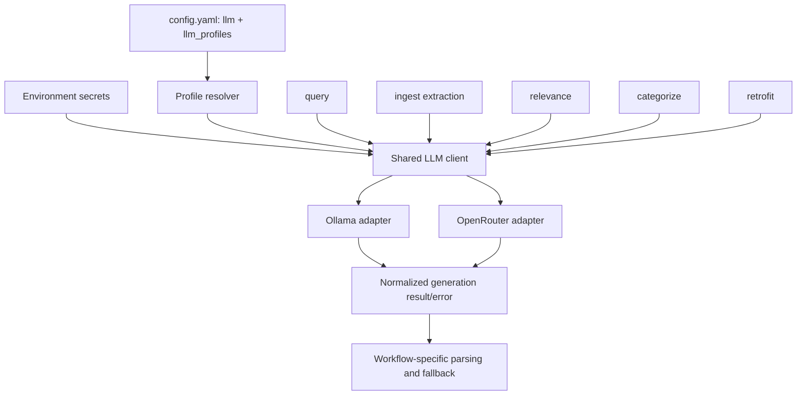

# feat: Add a central multi-provider LLM layer

## Goal Capsule

- **Objective:** Route every wiki LLM workflow through one tested provider boundary that keeps Ollama as the local default and permits explicit OpenRouter profiles for selected tasks.
- **Authority:** The user-confirmed all-workflow scope governs this plan. Existing workflow-specific prompts, conservative fallbacks, CLI compatibility, coordinated-write rules, and offline test constraints remain binding.
- **Execution profile:** Test-first migration in dependency order. Introduce the shared contract before moving callers, and keep each migration behaviorally narrow.
- **Stop conditions:** Stop if a migration would silently transmit locally configured content to OpenRouter, require committing a credential, change a workflow's product-level fallback semantics, or make offline operation depend on an external service.
- **Tail ownership:** After focused provider and workflow tests pass, run the complete unit suite, compilation, metadata validation, and diff hygiene gates.

---

## Product Contract

### Summary

The wiki will have one central text-generation interface for Ollama and OpenRouter. The existing top-level `llm:` section remains the backward-compatible default profile, while optional `llm_profiles:` entries select different providers and models for query synthesis, ingestion extraction, relevance checks, categorization, and provenance retrofit.

Standalone scripts will continue to work locally and unattended. OpenRouter is opt-in, credentials come only from an environment variable, and no workflow automatically escalates from a local provider to a remote provider. The model of an Agent invoking the skill is not treated as an API provider because the Python processes have no stable runtime interface to that Agent model.

### Problem Frame

LLM calls are currently distributed across `scripts/wiki_query.py`, `scripts/ingest_source.py`, `scripts/relevance_check.py`, `scripts/auto_categorize.py`, and `scripts/retrofit_provenance.py`. They construct Ollama requests independently, use different HTTP libraries and option shapes, and implement availability checks and errors locally. Only some callers consume `resolve_llm_config()`, so changing providers would otherwise duplicate OpenRouter request, authentication, response parsing, and error behavior in several scripts.

The shared `llm:` configuration already provides a useful compatibility anchor. Replacing it would force a migration without improving the common local case. The missing capability is layered profile resolution plus a provider-neutral generation boundary that translates the same request into Ollama's generate API or OpenRouter's OpenAI-compatible chat-completions API.

### Requirements

**Configuration and provider selection**

- R1. The existing top-level `llm:` configuration must remain valid and must default to the Ollama provider when `provider` is absent.
- R2. An optional `llm_profiles:` mapping must support the named profiles `query`, `ingest`, `relevance`, `categorize`, and `retrofit`; each profile must inherit compatible unspecified values from `llm:` and override only declared values. A profile that changes provider must declare its own model, and provider-specific endpoint fields must not cross the provider boundary.
- R3. Configuration resolution must normalize provider, model, endpoint, timeout, generation controls, and optional credential-environment name without reading or returning the credential itself.
- R4. Unsupported providers, missing required OpenRouter configuration, and invalid profile shapes must fail with actionable configuration errors before an HTTP request is attempted.
- R5. Existing model and Ollama URL CLI arguments must remain usable as explicit runtime overrides during migration.

**Shared generation boundary**

- R6. One shared client must accept a prompt, resolved profile, and request-level generation overrides and return provider-neutral response text plus minimal diagnostic metadata needed by callers and logs.
- R7. The Ollama adapter must preserve the current `/api/generate` behavior and translate `temperature`, `num_predict`, and `num_ctx` without changing current defaults.
- R8. The OpenRouter adapter must call `/api/v1/chat/completions`, authenticate with `Authorization: Bearer` from the configured environment variable, use non-streaming messages, and parse the first assistant message from the normalized response.
- R9. OpenRouter attribution headers may be configured, but they must be optional and must not be required for local or test operation.
- R10. Timeouts, transport failures, HTTP failures, malformed JSON, empty choices, and empty generated text must be represented consistently enough for each workflow to retain its own fallback behavior.
- R11. Logs and exceptions must identify provider and model while never including API keys or authorization headers.
- R12. Provider clients must be dependency-light and use the repository's existing `requests` dependency rather than adding a provider SDK.

**Workflow migration**

- R13. Query synthesis must resolve the `query` profile and preserve its existing answer, citation, inference-counting, latency, and failure-result contract.
- R14. Entity and concept extraction during ingestion must resolve the `ingest` profile and preserve prompt construction, JSON cleanup, provenance fields, and the current skip-on-LLM-error behavior.
- R15. Relevance classification must resolve the `relevance` profile while preserving hard-rule stages and its conservative `relevant` result when the LLM stage is unavailable or fails.
- R16. Automatic categorization must resolve the `categorize` profile and preserve the `general` fallback; it may attempt to start Ollama only when the resolved provider is Ollama.
- R17. Provenance retrofit must resolve the `retrofit` profile and preserve its current explicit failure behavior, dry-run behavior, and output parsing.
- R18. Direct Ollama request construction must be removed from migrated workflow modules; provider-specific availability and request logic belongs to the shared layer.

**Privacy and operations**

- R19. Selecting OpenRouter must be explicit in configuration. The system must never automatically fail over from Ollama to OpenRouter.
- R20. `OPENROUTER_API_KEY` must be the documented default credential variable, with an optional configurable environment-variable name; secrets must not appear in committed YAML, examples, logs, or test fixtures.
- R21. An OpenRouter failure must invoke the same workflow-specific fallback or failure path as an Ollama failure, not silently retry through a different provider.
- R22. The README must explain local-only defaults, profile inheritance, OpenRouter setup, data-egress implications, example configurations, and how unattended VPS jobs receive their environment variable.
- R23. Automated tests must be deterministic and offline, replacing HTTP calls and environment access with fakes or mocks.

### Acceptance Examples

- AE1. Given the current `config.yaml` without a `provider`, resolving any unnamed/default LLM configuration returns Ollama with the existing model, host, timeout, and generation values.
- AE2. Given `llm.provider: ollama` and `llm_profiles.query.provider: openrouter`, query synthesis uses OpenRouter while ingestion, relevance, categorization, and retrofit continue using inherited Ollama settings.
- AE3. Given a same-provider profile that overrides only `model`, the provider, endpoint, timeout, and generation defaults are inherited from `llm:` rather than reset; given a profile that changes provider without declaring a model, resolution fails before transport.
- AE4. Given an OpenRouter profile and no configured credential environment variable, generation raises an actionable configuration error before any mocked HTTP call occurs.
- AE5. Given an OpenRouter response containing `choices[0].message.content`, the shared client returns that text; empty choices, an empty message, invalid JSON, timeout, and non-success HTTP status produce the normalized failure path.
- AE6. Given a configured secret, captured logs, raised messages, and mock-call assertions do not contain the secret value.
- AE7. Given a relevance LLM timeout, the article remains conservatively relevant; given a categorization timeout, the category remains `general`; given ingestion extraction failure, ingestion continues without extracted entities and concepts.
- AE8. Given `categorize.provider: openrouter`, categorization does not probe `/api/tags`, call `launchctl`, or start `ollama serve`.
- AE9. Given legacy CLI overrides for model or Ollama URL, the affected workflow uses those overrides without requiring `llm_profiles:`.
- AE10. Given a locally unavailable Ollama profile, no request is sent to OpenRouter even when another OpenRouter profile exists.

### Key Flows

- F1. Profile resolution
  - **Trigger:** A workflow begins an LLM-backed operation.
  - **Steps:** Load `config.yaml`; select the workflow profile; merge it over `llm:`; apply explicit CLI/request overrides; validate the resolved provider configuration.
  - **Outcome:** The caller receives one normalized, secret-free configuration.
  - **Covered by:** R1-R5, AE1-AE4, AE9
- F2. Local generation
  - **Trigger:** The resolved provider is Ollama.
  - **Steps:** Translate the neutral generation request to `/api/generate`; issue a bounded non-streaming request; normalize the response or failure.
  - **Outcome:** Current local behavior remains the default for every workflow.
  - **Covered by:** R6-R7, R10-R12, AE1
- F3. Remote generation
  - **Trigger:** The selected workflow profile explicitly chooses OpenRouter.
  - **Steps:** Read the key from the named environment variable at call time; build the bearer-authenticated chat-completions request; parse the first assistant response; discard secret-bearing request context from diagnostics.
  - **Outcome:** The selected task uses OpenRouter without changing unrelated tasks.
  - **Covered by:** R8-R12, R19-R21, AE2, AE4-AE6
- F4. Workflow fallback
  - **Trigger:** Shared generation reports an availability, transport, protocol, or response error.
  - **Steps:** The workflow catches the common error and applies its existing domain fallback or failure contract.
  - **Outcome:** Provider unification does not flatten intentional differences between relevance, categorization, ingestion, query, and retrofit behavior.
  - **Covered by:** R13-R18, R21, AE7-AE10

### Scope Boundaries

**In scope**

- Provider-neutral text generation for every current LLM-backed workflow.
- Ollama and OpenRouter adapters, layered profiles, secret handling, compatibility overrides, diagnostics, tests, and operational documentation.
- Migration of query, ingestion extraction, relevance checking, categorization, and provenance retrofit.

**Deferred to follow-up work**

- Structured-output JSON Schema negotiation per OpenRouter model. The ingestion parser remains compatible with plain JSON/text responses in this change.
- Streaming, tool calls, multimodal requests, embeddings through OpenRouter, provider/model discovery, usage accounting, budgets, retries, circuit breakers, and configurable fallback chains.
- A benchmark-driven decision about which remote model is best for each profile.
- An Agent-mediated execution mode in which an interactive Agent performs synthesis directly and hands results back to the scripts.

**Outside this plan**

- Treating the model of Hermes, Codex, OpenClaw, or another skill-running Agent as an implicitly callable provider.
- Automatic local-to-remote failover or transmission of wiki content without an explicit OpenRouter profile.
- Replacing the current embedding model or GraphRAG retrieval pipeline.
- Changing prompts, categories, relevance policy, claim semantics, or wiki write coordination except where required to preserve them through the shared client.

---

## Planning Contract

### Key Technical Decisions

- KTD1. Preserve `llm:` as the base profile and add `llm_profiles:` as sparse overlays. This keeps existing installations valid and avoids duplicating common timeout and generation settings in every task profile. Generic controls may inherit across providers, but a provider change requires an explicit model and resets provider-specific endpoint fields to that provider's defaults unless explicitly configured.
- KTD2. Add a small repository-owned client in `scripts/llm_client.py`. The project already depends on `requests`; using direct HTTP avoids SDK weight and keeps provider translation visible and testable.
- KTD3. Expose a provider-neutral `generate_text` contract rather than provider-shaped payloads. Callers own prompts and domain fallbacks; the client owns endpoints, authentication, payload translation, response parsing, and normalized errors.
- KTD4. Read credentials at request time from an environment-variable name stored in resolved configuration. Resolution stays deterministic and secret-free, tests can control the environment, and a long-running process can report missing credentials at the actual use boundary.
- KTD5. Do not implement implicit provider fallback. Explicit profile selection is a privacy boundary; a local outage must never cause unannounced data egress.
- KTD6. Preserve workflow-level failure semantics instead of adding a universal fallback value. Relevance is deliberately conservative, categorization deliberately returns `general`, ingestion deliberately skips enrichment, query reports generation failure, and retrofit deliberately stops.
- KTD7. Retain legacy CLI flags as runtime overrides for one compatibility cycle. Internally they become normalized config overrides, so old automation works while new configuration uses profiles.
- KTD8. Use OpenRouter's stable chat-completions shape for this integration. Its normalized `choices[].message.content` contract is sufficient for current text generation, while the newer Responses API and structured-output features remain optional future capabilities.

### High-Level Design



The normalized configuration should distinguish generic keys from provider-specific ones. Generic keys include `provider`, `model`, `timeout`, `temperature`, and output-token/context controls. Ollama uses `host`; OpenRouter uses a base URL defaulting to `https://openrouter.ai/api/v1`, `api_key_env` defaulting to `OPENROUTER_API_KEY`, and optional attribution values. Request-level overrides remain explicit so short classifiers can retain their smaller output limits without defining duplicate profiles.

The shared client should raise a small exception hierarchy or one typed error carrying a stable category such as configuration, unavailable, timeout, HTTP, protocol, or empty response. It should not decide whether an article is relevant or which fallback category to return. That separation allows all five callers to share transport behavior while retaining their product contracts.

### Existing Patterns to Follow

- `scripts/wiki_core.py:resolve_llm_config()` is the current configuration normalization boundary and should remain the public resolver, extended with an optional profile name and override mapping.
- `scripts/wiki_query.py:generate_answer()` demonstrates the complete set of current generation controls and the query-specific result contract.
- `scripts/ingest_source.py:_call_ollama_extract()` owns prompt construction and tolerant JSON cleanup; those responsibilities stay in the workflow after transport extraction.
- `scripts/relevance_check.py:_ollama_relevance_check()` documents the conservative-on-failure behavior that the provider migration must preserve.
- `scripts/auto_categorize.py:categorize()` and `ensure_ollama_running()` show why provider-specific readiness/startup must be gated after profile resolution.
- `scripts/retrofit_provenance.py:call_ollama()` supplies the explicit-error behavior and the remaining `urllib` implementation to retire.
- `tests/test_config_resolution.py` establishes configuration compatibility tests using temporary YAML and environment isolation.
- `tests/test_wiki_query.py` and `tests/test_ingest_source.py` establish offline workflow tests with `unittest.mock`.

### External Interface Grounding

OpenRouter's official API documentation defines bearer-token authentication, an OpenAI-compatible `POST /api/v1/chat/completions` request, and non-streaming responses under `choices[].message`. The implementation should verify these assumptions against the official [API overview](https://openrouter.ai/docs/api/reference/overview), [authentication guide](https://openrouter.ai/docs/api/reference/authentication), and [error guide](https://openrouter.ai/docs/api/reference/errors-and-debugging) during execution because the integration is external and may evolve. The [structured-output guide](https://openrouter.ai/docs/guides/features/structured-outputs) is informative but deferred.

### Sequencing and Dependencies

U1 defines the configuration contract consumed by every later unit. U2 implements and verifies transport translation against that contract. U3 migrates the two primary content-producing paths. U4 migrates classifier and maintenance paths with their distinct fallback semantics. U5 updates operational documentation and performs repository-wide removal and verification checks. U3 and U4 may proceed independently only after U1 and U2 are complete.

### Risks and Mitigations

- **Silent data egress:** A fallback chain could send private wiki content remotely. Mitigation: explicit provider selection only, no implicit cross-provider retry, and a regression test asserting no OpenRouter call after Ollama failure.
- **Configuration ambiguity:** Inheriting an Ollama `host` into an OpenRouter profile could target the wrong endpoint. Mitigation: normalize provider-specific endpoint fields deliberately and validate incompatible combinations.
- **Behavior regression:** Centralizing errors could erase caller-specific fallback semantics. Mitigation: test every workflow's failure result before and after migration.
- **Secret leakage:** HTTP exceptions or debug logs could expose bearer headers. Mitigation: construct sanitized diagnostics and test with a distinctive fake secret that must never appear in messages or logs.
- **OpenRouter model variance:** Models differ in supported generation parameters and JSON fidelity. Mitigation: send only broadly supported parameters, keep request overrides minimal, and retain tolerant workflow parsers.
- **Legacy automation drift:** Existing `--model` and `--ollama-url` jobs could break. Mitigation: map flags to normalized overrides and test precedence explicitly.
- **Unintended Ollama startup:** OpenRouter categorization could still run local startup probes. Mitigation: make readiness checks provider-aware and assert no process or tags call in OpenRouter tests.

### Open Questions

- **Deferred:** Select concrete OpenRouter models for each remote profile after measuring quality, latency, context limits, and cost on representative wiki tasks. Documentation should use clearly labeled example model identifiers rather than declaring a permanent best model.
- **Deferred:** Decide whether a later release should support an explicit local fallback for OpenRouter failures. This plan intentionally avoids all cross-provider fallback to keep the first contract auditable.

---

## Implementation Units

### U1. Layered LLM configuration contract

- **Goal:** Extend configuration resolution without breaking the existing local configuration.
- **Files:** `scripts/wiki_core.py`, `config.yaml`, `tests/test_config_resolution.py`
- **Changes:** Add provider-aware defaults, optional profile selection, sparse inheritance from `llm:`, explicit runtime overrides, and validation. Keep credentials represented only by environment-variable name. Add commented or safe example profile structure without enabling remote calls in the committed default.
- **Patterns:** Extend `resolve_llm_config()` and the temporary-config tests already present in `tests/test_config_resolution.py`.
- **Covers:** R1-R5, R19-R20; F1; AE1-AE4, AE9
- **Test scenarios:**
  - Current configuration without `provider` resolves exactly to Ollama-compatible defaults.
  - Missing profile inherits the base profile; a partial same-provider profile overrides only declared fields.
  - A provider-changing profile must declare its own model and must not inherit the other provider's endpoint field.
  - Runtime overrides win over profile values, which win over base values, which win over built-in defaults.
  - OpenRouter gets its default base URL and credential environment name without reading the secret.
  - Invalid provider, non-mapping profile, missing model, invalid timeout, and incompatible endpoint configuration fail before transport.
  - Loading committed `config.yaml` remains local-only.
- **Verification:** `python3 -m unittest tests.test_config_resolution`

### U2. Shared Ollama and OpenRouter generation client

- **Goal:** Provide one dependency-light, provider-neutral HTTP boundary with sanitized diagnostics.
- **Files:** `scripts/llm_client.py`, `tests/test_llm_client.py`, `requirements.txt`
- **Changes:** Define the neutral request/result contract, common error taxonomy, Ollama request/response adapter, OpenRouter chat-completions adapter, environment credential lookup, optional attribution headers, timeout handling, response validation, and secret-safe diagnostics. Do not add a provider SDK or fallback chain.
- **Patterns:** Use the existing `requests` dependency and the current payload options in `scripts/wiki_query.py`; keep HTTP seams mockable like other repository tests.
- **Covers:** R6-R12, R19-R21, R23; F2-F3; AE4-AE6, AE10
- **Test scenarios:**
  - Ollama payload uses `/api/generate`, `stream: false`, and correctly translated options; response text is normalized.
  - OpenRouter payload uses `/api/v1/chat/completions`, a user message, the selected model, supported generation controls, and bearer authentication from the configured environment variable.
  - Optional attribution headers appear only when configured.
  - Missing key prevents HTTP; timeout, connection error, non-success status, malformed JSON, empty choices, non-text content, and blank text map to stable normalized errors.
  - Provider and model appear in diagnostics, while a distinctive fake API key never appears in exceptions or captured logs.
  - Ollama failure does not trigger an OpenRouter request and OpenRouter failure does not trigger Ollama.
- **Verification:** `python3 -m unittest tests.test_llm_client`

### U3. Query and ingestion extraction migration

- **Goal:** Move the primary answer- and knowledge-producing workflows to the shared client without changing prompts or result semantics.
- **Files:** `scripts/wiki_query.py`, `scripts/ingest_source.py`, `tests/test_wiki_query.py`, `tests/test_ingest_source.py`
- **Changes:** Resolve `query` and `ingest` profiles, replace direct Ollama HTTP construction with `generate_text`, preserve per-call token/temperature overrides, keep query metrics and citations intact, and keep ingestion's tolerant JSON cleanup and skip-on-error path. Rename private Ollama-specific helpers only where needed to reflect provider-neutral behavior.
- **Patterns:** Preserve `generate_answer()`'s tuple contract and `_call_ollama_extract()`'s downstream entity/concept shape.
- **Covers:** R13-R14, R18, R21, R23; F4; AE2, AE5, AE7
- **Test scenarios:**
  - Query selects the `query` profile, passes the existing prompt and generation controls, and returns the same answer/metric tuple for a successful normalized response.
  - Query maps a common client failure to its existing user-visible failure result without leaking provider credentials.
  - Ingestion selects the `ingest` profile, parses raw JSON and fenced JSON exactly as before, and preserves provenance metadata.
  - Ingestion client failure returns an empty extraction result and does not prevent raw source ingestion.
  - Neither module contains or invokes `/api/generate` directly after migration.
- **Verification:** `python3 -m unittest tests.test_wiki_query tests.test_ingest_source`

### U4. Relevance, categorization, and retrofit migration

- **Goal:** Move the remaining LLM workflows while preserving their intentionally different availability and failure behavior.
- **Files:** `scripts/relevance_check.py`, `scripts/auto_categorize.py`, `scripts/retrofit_provenance.py`, `tests/test_relevance_check.py`, `tests/test_auto_categorize.py`, `tests/test_retrofit_provenance.py`, `tests/test_config_resolution.py`
- **Changes:** Resolve each named profile, replace direct HTTP/`urllib` paths, map legacy CLI flags into overrides, gate Ollama readiness/startup by provider, and retain conservative relevance, `general` categorization, and explicit retrofit errors.
- **Patterns:** Preserve hard-rule ordering in `check_relevance()`, category validation in `categorize()`, and dry-run/root resolution already tested for retrofit.
- **Covers:** R15-R18, R21, R23; F4; AE7-AE10
- **Test scenarios:**
  - Relevance hard-rule stages never invoke the shared client; a gray-zone success interprets relevant/irrelevant as before; every normalized LLM error returns conservatively relevant.
  - Categorization validates known categories from normalized text and returns `general` for unknown text or client failure.
  - OpenRouter categorization never probes Ollama tags, invokes `launchctl`, or starts an Ollama subprocess; Ollama retains its current readiness behavior.
  - Retrofit returns generated text on success, raises its established runtime error on common client failure, and remains network-free in dry-run mode where applicable.
  - Legacy model and Ollama URL CLI options override the relevant resolved profile without changing unrelated profiles.
  - No migrated module constructs `/api/generate` or OpenRouter headers directly.
- **Verification:** `python3 -m unittest tests.test_relevance_check tests.test_auto_categorize tests.test_retrofit_provenance tests.test_config_resolution`

### U5. Operational documentation and integration cleanup

- **Goal:** Make the provider system safe to configure on local machines and VPS jobs and prove the repository has one LLM transport boundary.
- **Files:** `README.md`, `SKILL.md`, `config.yaml`, `tests/test_skill_metadata.py`, `tests/test_config_resolution.py`
- **Changes:** Document base/profile inheritance, local-only default, OpenRouter key setup, example task split, VPS environment injection, privacy implications, supported overrides, and failure behavior. Update skill instructions only where they describe model prerequisites or invocation. Remove stale Ollama-only wording that is no longer true while retaining local setup guidance.
- **Patterns:** Follow the current configuration and operational sections in `README.md` and the metadata validation contract in `tests/test_skill_metadata.py`.
- **Covers:** R20-R23; AE1-AE3, AE10
- **Test scenarios:**
  - Committed configuration contains no secret and enables no remote provider by default.
  - Documentation examples use `api_key_env: OPENROUTER_API_KEY`, never a literal key.
  - Repository search finds provider endpoint construction only in `scripts/llm_client.py` and documentation/tests where intentionally referenced.
  - Skill metadata validation remains green after wording changes.
- **Verification:** `python3 scripts/validate_skill_metadata.py` plus the full verification contract below.

---

## Verification Contract

| Gate | Command | Covers | Done signal |
|---|---|---|---|
| Configuration | `python3 -m unittest tests.test_config_resolution` | U1, U4, U5 | Layering, validation, defaults, and CLI compatibility pass |
| Shared client | `python3 -m unittest tests.test_llm_client` | U2 | Both adapters and all normalized failures pass offline |
| Primary workflows | `python3 -m unittest tests.test_wiki_query tests.test_ingest_source` | U3 | Query and ingestion preserve contracts through the shared client |
| Remaining workflows | `python3 -m unittest tests.test_relevance_check tests.test_auto_categorize tests.test_retrofit_provenance` | U4 | Classifier and maintenance fallback semantics pass |
| Complete suite | `python3 -m unittest discover -s tests -p 'test_*.py'` | U1-U5 | All repository tests pass without live Ollama or OpenRouter |
| Syntax | `python3 -m compileall -q scripts tests` | U1-U5 | All changed Python modules compile |
| Skill metadata | `python3 scripts/validate_skill_metadata.py` | U5 | Skill metadata and referenced paths validate |
| Transport boundary | `rg -n 'api/generate|api/v1/chat/completions|Authorization.*Bearer' scripts --glob '*.py'` | U2-U5 | Provider request construction exists only in `scripts/llm_client.py` |
| Secret hygiene | `rg -n 'sk-or-v1-|OPENROUTER_API_KEY\s*:' . --glob '!docs/plans/*.md' --glob '!tests/*.py'` | U2, U5 | No committed literal key or key-shaped YAML value exists |
| Diff hygiene | `git diff --check` | U1-U5 | No whitespace errors |

External network calls are excluded from required verification. An optional manual smoke test may be run only with user-provided credentials and an explicitly selected low-cost OpenRouter profile; it must not become a completion gate.

---

## Definition of Done

- D1. `llm:` remains a working Ollama default for an unchanged installation.
- D2. Every current LLM workflow resolves its named profile and uses `scripts/llm_client.py` for generation.
- D3. Ollama and OpenRouter request translation, response parsing, errors, and secret hygiene have deterministic offline tests.
- D4. Query, ingestion, relevance, categorization, and retrofit preserve their current prompt ownership, result shapes, and domain-specific fallback semantics.
- D5. OpenRouter can be enabled for one workflow without changing the provider used by any other workflow.
- D6. No local failure can implicitly send wiki content to OpenRouter.
- D7. OpenRouter credentials are read from the environment and never stored or logged.
- D8. Legacy CLI model/Ollama endpoint overrides continue to work through the normalized configuration layer.
- D9. Categorization starts or probes Ollama only for an Ollama profile.
- D10. Documentation explains configuration, VPS operation, privacy, errors, and the non-callability of the invoking Agent model from standalone scripts.
- D11. All verification-contract gates pass, and required tests do not contact live providers.

---

## Appendix

### Suggested Configuration Shape

This is directional configuration guidance, not implementation code:

```yaml
llm:
  provider: ollama
  model: gemma4:e4b
  host: http://localhost:11434
  timeout: 180
  temperature: 0.3
  num_predict: 8192
  num_ctx: 65536

llm_profiles:
  query:
    provider: openrouter
    model: provider/example-model
    base_url: https://openrouter.ai/api/v1
    api_key_env: OPENROUTER_API_KEY
```

Profiles omitted from `llm_profiles:` inherit the local base. A real model identifier should be chosen during deployment based on current OpenRouter availability and measured task quality rather than hard-coded as a planning decision.
