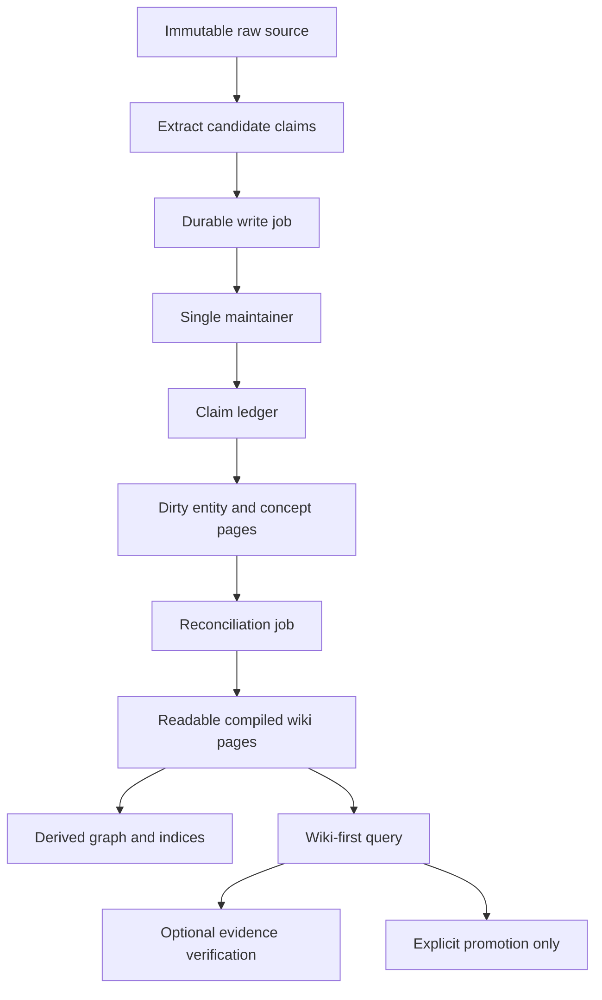

# Compounding Wiki Core - Plan

## Goal Capsule

- **Objective:** Evolve `knowledge-wiki` from a source-indexing GraphRAG pipeline into a file-native LLM wiki that reconciles new evidence into durable, reviewable knowledge pages.
- **Authority:** Preserve immutable raw sources and the existing Markdown wiki as the canonical human-readable artifact. Add no external database.
- **Execution profile:** Characterize existing behavior before replacing write paths; keep each migration idempotent and restart-safe.
- **Stop conditions:** Stop for a product decision if the proposed claim lifecycle cannot represent a real conflict without silently discarding either source, or if a compatibility migration would alter raw source contents.

---

## Product Contract

### Summary

The wiki will compile evidence from immutable sources into continuously updated entity and concept pages. It will retain claim-level provenance, serialize mutations from multiple agents, and distinguish disposable query output from promoted knowledge.

### Problem Frame

The current ingest path creates useful source files, entity stubs, concepts, indices, graph data, and query syntheses. Existing entity and concept bodies do not materially change when later sources concern the same topic; only their source list and page-level confidence are updated. Concurrent writers can also race while updating Markdown and derived JSON artifacts. This prevents the repository from accumulating reconciled knowledge in the way an LLM-maintained wiki should.

### Requirements

#### Compounding knowledge

- R1. Preserve all `raw/` source bodies and source frontmatter as immutable after ingest.
- R2. Represent extracted and reconciled knowledge as individual claims with source evidence, temporal metadata, confidence, and lifecycle state.
- R3. Reconcile all affected entity and concept pages after a new source is accepted, incorporating support, contradiction, supersession, and unresolved gaps without erasing prior evidence.
- R4. Generate pages that remain readable and useful without the runtime index, including a concise current synthesis, disagreements, open questions, and source links.

#### Safe multi-agent operation

- R5. Serialize all mutations to canonical wiki files and derived artifacts so concurrent local or VPS agents cannot lose updates or leave partially written files.
- R6. Make write jobs idempotent, observable, and recoverable after interruption; a rerun must converge to the same page and derived-artifact state.
- R7. Keep existing CLI workflows functional while introducing an explicit maintainer/write boundary.

#### Query and quality control

- R8. Make compiled wiki pages the preferred query context and use raw sources for evidence verification and gap filling.
- R9. Do not persist ordinary query answers by default. Persist only explicitly promoted answers with a clear lifecycle state and provenance.
- R10. Add deterministic fixtures and evaluation tests for reconciliation, provenance, retrieval, citations, and conflict handling.

#### Package quality

- R11. Reduce `SKILL.md` to routing, invariants, and canonical workflows; keep incident-specific recovery material in focused references.
- R12. Make model/provider and skill metadata portable across Hermes and Codex without changing the current Ollama default.

### Acceptance Examples

- AE1. When a second source supports an existing claim, the relevant page becomes more strongly evidenced and links both sources without duplicating the claim.
- AE2. When a newer source conflicts with an existing claim, the page presents both positions, marks the earlier claim as conflicted or superseded as appropriate, and retains evidence for each.
- AE3. When two agents submit overlapping writes, the resulting canonical page, graph, and indices correspond to a serial ordering of those jobs; no partial JSON or lost source reference is observable.
- AE4. When an agent asks an exploratory question, it receives a cited response but no `synthesis/` file is created unless it explicitly promotes the result.
- AE5. After a fresh clone and configuration, the skill validates under the supported skill metadata rules and resolves the model configuration from one shared source.

### Scope Boundaries

- Keep Markdown and repository history as the canonical knowledge store; do not introduce Postgres, a hosted vector store, or GBrain in this plan.
- Keep the current local CLI and Ollama path working; an HTTP/MCP server and distributed job broker are deferred.
- Do not rewrite or delete historical raw sources during migration.
- Defer full authorization, team tenancy, and remote identity design until a concrete multi-user serving surface exists.

---

## Planning Contract

### Key Technical Decisions

- KTD1. Store claim records in versioned JSON sidecars under `wiki/claims/<page-kind>/<slug>.json`, one sidecar per entity or concept page. Markdown remains the canonical human-facing projection; sidecars keep structured claims, evidence locators, and lifecycle transitions out of hand-authored frontmatter.
- KTD2. Treat claims, not pages, as the unit of evidence. Page confidence is derived for display and linting, never used as the only provenance signal.
- KTD3. Use a single-host writer coordinator backed by a filesystem lock and durable job journal. Every mutating CLI path submits an idempotent job; the coordinator holds the lock across read-modify-write, records progress, atomically replaces files, and recovers pending jobs on the next invocation.
- KTD4. Publish a generation manifest only after the affected page projections and all derived graph/index/embedding artifacts validate. Readers resolve the manifest before reading compiled state, so they see one serially consistent generation rather than a mix of old and new artifacts.
- KTD5. Query compiled pages first, then load raw evidence only for claims used in the answer. This makes prior synthesis the primary context rather than repeatedly rebuilding it from source documents.
- KTD6. Keep generated query output ephemeral by default. Promotion is an intentional write that creates an analysis page with explicit source references and review state.
- KTD7. Build deterministic evaluation fixtures before changing reconciliation behavior. Live URLs, Ollama, Playwright, mail, and YouTube remain smoke tests rather than the regression oracle.
- KTD8. Auto-supersede only when a claim has a strictly newer applicability interval and higher source authority. All other disagreement remains `conflicted` or `needs-review`; an LLM never silently selects a winner.

### High-Level Technical Design

### Data and Lifecycle Shape

Each claim will carry a stable identifier, normalized statement, subject/page target, one or more evidence locators, `observed_at`, `ingested_at`, `valid_from`/`valid_through` when known, confidence, source authority, and one lifecycle state: `single-source`, `supported`, `conflicted`, `superseded`, `inferred`, or `needs-review`.

An evidence locator contains the immutable raw-source path, source content hash, normalized excerpt hash, character range, extractor version, and source tier (`primary`, `secondary`, `derived`, or `user-confirmed`). Validation rejects a locator whose source or excerpt no longer matches. Reconciliation may automatically supersede only a lower-tier claim with an earlier non-overlapping applicability interval; ties and missing temporal data remain visible for review.

Reconciliation produces a deterministic page projection from claims. It must preserve the existing readable title, links, and editorial material outside generated sections. It may update generated summary, current claims, disagreements, open questions, and sources. It applies the authority and temporal policy from KTD8, explaining the selected current position whenever evidence conflicts.

### Assumptions

- The existing YAML frontmatter parser can be extended or replaced without requiring a new external dependency.
- A local filesystem lock is sufficient for the first single-host maintainer boundary. Remote callers will submit to that host rather than share a filesystem.
- Existing entity and concept pages without claim records can be migrated into conservative `needs-review` or `single-source` records using current `source_refs`; ambiguous prose will not be represented as verified claims automatically.

### Risks and Dependencies

- LLM extraction can produce unstable claim wording. Normalize and deduplicate with deterministic keys before reconciliation, and preserve the original extracted text for review.
- A claim migration can overstate historical evidence. Backfill conservatively and report pages requiring review instead of inventing evidence spans.
- File locking protects one host, not shared network filesystems. Document the single-writer deployment requirement and defer distributed locking.
- Graph, index, embeddings, and lint logic currently consume page-level metadata. They require coordinated compatibility changes before claim fields become authoritative.
- The first snapshot implementation is a local generation directory plus atomic manifest pointer. It trades temporary duplicate derived artifacts for a reader-consistent state and can be compacted after a successful publish.

---

## Implementation Units

### U1. Establish atomic canonical writes and a maintainer boundary

- **Goal:** Route canonical mutations through one restart-safe writer and prevent torn or lost updates.
- **Requirements:** R5, R6, R7; Covers AE3.
- **Dependencies:** None.
- **Files:** `scripts/wiki_core.py`, new `scripts/wiki_maintain.py`, `scripts/ingest_source.py`, `scripts/auto_ingest.py`, `scripts/wiki_query.py`, `scripts/wiki_log.py`, `scripts/wiki_lint.py`, `scripts/retrofit_provenance.py`, `scripts/migrate_paths.py`, `scripts/auto_categorize.py`, `scripts/regen_index.py`, `scripts/wiki_graph_builder.py`, `tests/test_wiki_core.py`, `tests/test_ingest_source.py`, new `tests/test_wiki_writer.py`.
- **Approach:** Inventory every existing write path and classify it as immutable raw ingest, canonical compiled knowledge, derived artifact, or operational log. Add a shared coordinator for every canonical and derived write. Its protocol locks the complete read-modify-write transaction, records an idempotency key and pending state, writes and syncs a temporary file, replaces the target, syncs the parent directory, then records completion. Process-bound locks recover automatically after a crash; pending jobs are replayed deterministically on the next coordinator invocation. Keep raw-source creation as a separately audited ingest operation and keep read-only operations outside the lock.
- **Patterns to follow:** `resolve_wiki_root`, `resolve_raw_descendant`, and the current idempotent duplicate handling in `scripts/wiki_core.py` and `scripts/ingest_source.py`.
- **Test scenarios:**
  - Two overlapping jobs that update one page yield one complete page containing both updates.
  - Interruption before atomic replacement leaves the prior valid file readable and the job retryable.
  - Retrying a completed job does not duplicate source references or graph/index entries.
  - A reader during a write never receives invalid YAML or invalid JSON.
  - Every pre-existing canonical writer is either routed through the coordinator or explicitly rejected as a compatibility wrapper.
  - Crash simulation after claim, after temporary write, after replacement, and before completion record converges on one valid result after retry.
- **Verification:** All canonical writers use the shared boundary; concurrency fixtures pass without live services.

### U2. Introduce a file-native claim ledger and conservative migration

- **Goal:** Replace page-level provenance as the sole knowledge model with claim-level records while preserving existing pages and raw sources.
- **Requirements:** R1, R2, R6; Covers AE1 and AE2.
- **Dependencies:** U1.
- **Files:** `scripts/wiki_core.py`, `scripts/ingest_source.py`, `scripts/retrofit_provenance.py`, `scripts/wiki_lint.py`, new `scripts/migrate_claim_ledger.py`, `tests/test_wiki_core.py`, `tests/test_ingest_source.py`, new `tests/test_claim_ledger.py`.
- **Approach:** Define the versioned sidecar schema, normalized claim identity, evidence-locator integrity contract, source authority, state transitions, and discovery API. Add an opt-in migration with checkpoint metadata and dual-read compatibility: migrated pages continue exposing legacy `source_refs` until all graph/index/lint consumers read sidecars. Leave raw source files untouched, retain rollback artifacts until the cutover verification succeeds, and emit a review report for pages without sufficient evidence.
- **Patterns to follow:** Existing frontmatter parsing/dumping and `retrofit_provenance.py` dry-run/apply conventions.
- **Test scenarios:**
  - Valid claims round-trip through the shared parser without changing unrelated frontmatter or prose.
  - Duplicate normalized claims merge evidence rather than creating duplicate records.
  - Ambiguous legacy pages remain review-required rather than receiving fabricated evidence.
  - Dry-run migration changes no files; apply is idempotent and preserves raw-file hashes.
  - Invalid state transitions and malformed evidence references produce actionable validation errors.
  - A missing or hash-mismatched evidence excerpt invalidates only the affected claim and is surfaced for review.
  - A migrated page remains readable by the legacy graph/index path until the compatibility cutover completes, and rollback restores the prior projection without touching `raw/`.
- **Verification:** Claim schema validation and migration fixtures pass; a second migration run is a no-op.

### U3. Add extraction-to-reconciliation workflow for entity and concept pages

- **Goal:** Turn new source ingestion into an evidence update that materially refreshes affected wiki pages.
- **Requirements:** R2, R3, R4, R6; Covers AE1 and AE2.
- **Dependencies:** U1, U2.
- **Files:** `scripts/ingest_source.py`, `scripts/wiki_core.py`, new `scripts/wiki_reconcile.py`, `scripts/wiki_lint.py`, `tests/test_ingest_source.py`, new `tests/test_wiki_reconcile.py`.
- **Approach:** Separate candidate claim extraction from page mutation. Ingest records claims and marks impacted entity/concept pages dirty; the reconciler evaluates support, conflict, supersession, and gaps using the authority/temporal policy, then rewrites only generated page sections through the maintainer boundary. Preserve non-generated editorial content and rebuild the existing source-links section from authoritative claim evidence.
- **Execution note:** Start with characterization tests for existing entity/concept page preservation before changing their update behavior.
- **Patterns to follow:** Existing entity/concept path conventions, `rebuild_source_links`, wikilink injection, and source reference normalization.
- **Test scenarios:**
  - First supporting source creates a concise page and a `single-source` claim.
  - Independent supporting evidence promotes the claim to `supported` and refreshes the summary.
  - A later contradictory claim produces a disagreement section with both sources intact.
  - A temporally newer, authoritative claim marks the applicable older claim `superseded` without deleting it.
  - Reconciliation preserves manually written text outside generated markers.
  - A failed reconciliation leaves the dirty marker visible and succeeds on retry.
- **Verification:** Fixture-based ingest followed by reconciliation produces stable page snapshots across repeated runs.

### U4. Make derived artifacts and linting claim-aware

- **Goal:** Rebuild graph, indices, embeddings, and health checks from reconciled canonical pages and claim metadata without inconsistent intermediate output.
- **Requirements:** R3, R5, R6, R10; Covers AE3.
- **Dependencies:** U1, U2, U3.
- **Files:** `scripts/wiki_graph_builder.py`, `scripts/regen_index.py`, `scripts/wiki_lint.py`, `scripts/weekly_wiki_lint.sh`, `scripts/wiki_query.py`, new `tests/test_wiki_graph_builder.py`, new `tests/test_wiki_lint.py`.
- **Approach:** Replace direct page-confidence assumptions with derived claim summaries. Run graph/index/embedding rebuilds as coalesced maintainer follow-up jobs after a reconciliation batch. Stage changed projections and all derived artifacts in a numbered generation, validate them, and atomically publish a manifest pointer that readers resolve before querying. Have lint report stale dirty pages, unsupported claims, unresolved conflicts, orphaned evidence, failed jobs, and abandoned generations.
- **Patterns to follow:** Current JSON artifact formats and the existing lint report shape; preserve compatible fields where downstream scripts still consume them.
- **Test scenarios:**
  - A claim-backed page produces graph edges for all valid source evidence.
  - A conflicted page remains queryable and is surfaced by lint rather than silently excluded.
  - Batched source updates trigger one consistent derived-artifact rebuild.
  - Failed derived-artifact work is retryable without changing canonical pages.
  - Legacy pages remain indexed during migration.
  - A reader sees either the prior or the next manifest generation, never a new page paired with an old graph or index.
- **Verification:** Graph/index JSON remains valid under concurrent-job fixtures and lint identifies each intentionally injected data-quality failure.

### U5. Rework query behavior around compiled knowledge and explicit promotion

- **Goal:** Prefer compiled wiki knowledge in query context and make persistence a deliberate action.
- **Requirements:** R4, R8, R9, R10; Covers AE4.
- **Dependencies:** U2, U3, U4.
- **Files:** `scripts/wiki_query.py`, `scripts/wiki_graph_builder.py`, `scripts/regen_index.py`, `scripts/wiki_log.py`, new `tests/test_wiki_query.py`.
- **Approach:** Rank reconciled entity/concept/overview pages before raw sources, then load evidence only for claims used in the final answer or for explicit gap analysis. Add query modes for ephemeral answers and promoted analyses; promotion submits a canonical write job through U1, records source claims, confidence, review state, and promotion intent, and publishes only through the generation manifest. Exclude non-promoted or stale analyses from primary retrieval.
- **Patterns to follow:** Existing citation post-processing, confidence display, and synthesis frontmatter conventions.
- **Test scenarios:**
  - A query finds a compiled concept page before raw documents while retaining clickable evidence citations.
  - A question needing missing evidence loads the relevant raw source and reports the gap.
  - Default execution creates no synthesis file or index entry.
  - Explicit promotion creates one idempotent analysis page with only cited claim/source references.
  - Concurrent or interrupted promotion produces either no page or one complete, idempotent promoted page through the writer coordinator.
  - Promoted analyses never become self-citations in later answers.
- **Verification:** Retrieval fixtures prove wiki-first ranking, source attribution, no default write, and promotion idempotency.

### U6. Build deterministic quality fixtures and regression evaluation

- **Goal:** Make knowledge quality measurable without relying on live URLs or model availability.
- **Requirements:** R10; Covers AE1, AE2, AE3, and AE4.
- **Dependencies:** U2, U3, U4, U5.
- **Files:** new `tests/fixtures/compounding_wiki/`, new `tests/test_wiki_evaluation.py`, `tests/test_ingest_source.py`, `tests/test_wiki_reconcile.py`, `tests/test_wiki_query.py`, `requirements.txt` only if a missing test-only dependency is justified.
- **Approach:** Create a compact fixture corpus with support, contradiction, temporal supersession, duplicate evidence, ambiguous legacy pages, and query-promotion cases. Define deterministic assertions for source recall, citation precision, unsupported-claim detection, conflict visibility, preservation of raw content, and idempotency. Keep model calls behind recorded extraction fixtures.
- **Test scenarios:**
  - The evaluation corpus reports expected source recall and citation coverage for each fixed question.
  - Every generated current claim has at least one valid source reference.
  - Conflicting evidence appears in the expected page section and lint report.
  - Rerunning the full fixture pipeline leaves the tree byte-stable except permitted job timestamps.
  - Evaluation fails when a generated answer contains an uncited factual claim.
- **Verification:** The standard unittest suite includes the evaluation corpus and documents a stable, local quality gate.

### U7. Simplify skill instructions and centralize provider configuration

- **Goal:** Make the package easier for agents to load and portable across supported runtimes.
- **Requirements:** R7, R11, R12; Covers AE5.
- **Dependencies:** U1 through U6 define the final workflow surface.
- **Files:** `SKILL.md`, `README.md`, `config.yaml`, `requirements.txt`, `references/`, new `scripts/validate_skill_metadata.py`, `tests/test_docs.py`, `tests/test_config_resolution.py`, new `tests/test_skill_metadata.py`.
- **Approach:** Keep `SKILL.md` to triggers, routing, invariants, maintainer/write rules, and canonical commands. Move provider-specific failures and source-type troubleshooting into linked references. Resolve model name, host, timeout, and extraction model through one configuration API. Remove or relocate metadata fields rejected by the Codex validator while retaining Hermes-compatible documentation. Add a repository-owned, dependency-light metadata validator that codifies the supported frontmatter contract; use the external Codex validator as an optional compatibility smoke check rather than the only deterministic gate.
- **Patterns to follow:** Existing `references/` routing, `resolve_wiki_root` configuration precedence, and documentation-link tests.
- **Test scenarios:**
  - Every required local reference linked from `SKILL.md` resolves.
  - The declared frontmatter validates under the supported Codex skill validator.
  - CLI and ingest paths use the same configured provider settings.
  - Documentation describes the single-writer rule and the explicit promotion workflow.
  - No personal filesystem path or stale incident workaround remains in the primary skill instructions.
- **Verification:** Documentation, configuration, and metadata tests pass without Ollama, browser, network, email, or a personal wiki root.

---

## Verification Contract

| Gate | Applies to | Done signal |
|---|---|---|
| Python syntax | U1-U7 | `python3 -m compileall -q scripts tests` succeeds. |
| Unit and evaluation suite | U1-U7 | `python3 -m unittest discover -s tests -p 'test_*.py'` succeeds using only temporary roots and fixtures. |
| Documentation links | U7 | `tests/test_docs.py` validates every declared local reference. |
| Skill metadata | U7 | Repository-owned metadata validation accepts `SKILL.md`; the supported external validator passes when available. |
| Write safety | U1-U4 | Concurrency and interruption fixtures leave valid canonical Markdown and JSON artifacts. |
| Raw-source immutability | U2-U6 | Fixture source hashes remain unchanged after migration, reconciliation, query, and retry runs. |
| Optional live smoke | U3 and U7 | A real source ingest and configured-provider run is performed only after deterministic gates pass. |

---

## Definition of Done

- Every canonical knowledge write uses the maintainer boundary, its durable journal, and atomic replacement.
- Existing wiki content migrates without modifying `raw/` source bodies or fabricating evidence.
- Reconciliation changes relevant entity/concept page content when later evidence supports, contradicts, or supersedes prior claims.
- Compiled pages expose current knowledge, disagreements, gaps, and provenance in Markdown without requiring the runtime graph.
- Queries are read-only by default; promotion is explicit, cited, and idempotent.
- Graph, indices, embeddings, and lint output remain compatible during migration, become claim-aware after reconciliation, and publish through a reader-resolved generation manifest.
- The deterministic evaluation corpus guards quality regressions and the full local verification contract passes.
- `SKILL.md` validates, routes writers through the maintainer boundary, and links to focused operational references.
- Abandoned compatibility paths and experimental code are removed before completion.
